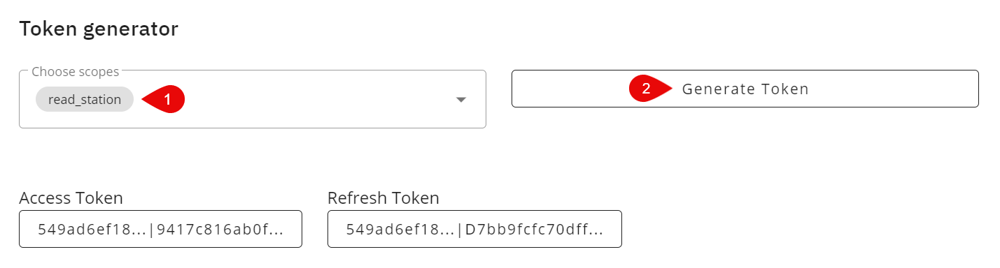

# netatmo-api-client [](https://www.npmjs.com/package/netatmo-api-client) [](https://www.npmjs.com/package/netatmo-api-client)

This is a simple client for the Netatmo Weather API.

## Getting started

1. create an account on https://dev.netatmo.com
2. create an app (information can be arbitrary)
   1. use the client ID and client secret of the created app
3. request a token by using the token generator
   1. select scope `read_station`
   2. click `Generate Token`
   3. use the generated access and refresh tokens



## Example usage

```ts
const netatmoClient = new NetatmoApiClient('<CLIENT_ID>', '<CLIENT_SECRET>');

// set tokens acquire from the token generator
netatmoClient.setTokens('<ACCESS_TOKEN>', '<REFRESH_TOKEN>');

// use the client
const stationData = await netatmoClient.getStationData();
```
